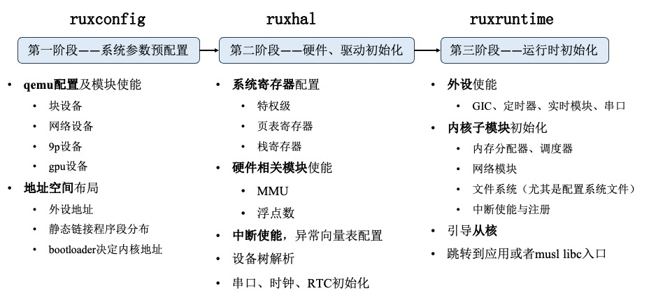

# 配置及运行时初始化

为了规范的配置操作系统的各项参数，以及设置虚拟机的相关参数，RuxOS 分为了三个阶段来进行内核配置及相关运行时的初始化，如下图所示。

    

### RuxOS 基本参数配置 ruxconfig

ruxconfig 模块定义了操作系统和 qemu 提供的内存等基本参数，包括：物理内存起始地址、物理内存大小、虚拟地址起始地址、外设地址等，其中 qemu 的具体配置借助的是 make 脚本，链接相关地址布局定义在 ruxhal 中，但在内核引导之前被使用。

### RuxOS 硬件抽象层 ruxhal

ruxhal 模块为内核引导的重要模块，[上图](#配置及运行时初始化)的第二阶段描述了这一层做的具体工作，这里对其中的调用链进行简单介绍：

- `_start`：该函数为 qemu 引导完成后跳入内核代码的第一个函数，在该函数中完成了相关寄存器的初始化，并使能了虚拟地址。

- `rust_entry`：配置页表、初始化异常处理模块等，这里是入口函数的补充，与具体平台的相关外设、硬件设备相关。

### RuxOS 运行时 ruxruntime

ruxruntime 模块提供了操作系统和应用运行时初始化入口，从 ruxhal 的 `rust_entry` 结束后，跳转到 ruxruntime 的 `rust_main` 入口，在这里进行诸多软件相关的初始化，包括内核各个子模块初始化、从核引导、musl libc 初始栈布局等工作，是 RuxOS 初始化的重要模块。

