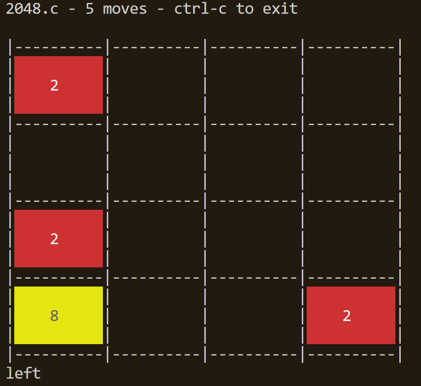

# WAMR

RuxOS supports running wasm applications on Qemu through wasm runtime [WAMR](https://github.com/bytecodealliance/wasm-micro-runtime).

## 1. Introduction to WAMR

WAMR is a lightweight wasm runtime that supports running wasm applications on embedded devices. RuxOS provides wasm applications of Hello World and 2048 game as examples. And it also supports WASI-NN, which has the ability to run neural network models.

Clone [rux-wamr](https://github.com/syswonder/rux-wamr) to the apps/c directory of the RuxOS project, with the following structure:

```txt
├── axbuild.mk
├── CMakeLists.txt
├── features.txt
├── README.md
├── rootfs
│   ├── ...
├── wamr.patch
```

## 2. Compile WAMR and run the example

The compilation of `WAMR` depends on `cmake`.

Run the following command in the RuxOS root directory, which will start the hello world wasm application.

```shell
make A=apps/c/rux-wamr ARCH=aarch64 LOG=info SMP=4 MUSL=y NET=y V9P=y V9P_PATH=apps/c/rux-wamr/rootfs ARGS="iwasm,/main.wasm" run
```

Parameter explanation:

* `A`: This parameter points to the directory where the WAMR application is located.

* `ARCH`: `ARCH` indicates on which architecture RuxOS is running, and the optional architecture parameters include: `x86_64`, `aarch64`, `riscv64`.

* `LOG`: `LOG` indicates the output log level, and a lower log level means more detailed output. Optional include: `error`, `warn`, `info`, `debug`, `trace`.

* `SMP`: `SMP` is used to enable the multi-core feature of RuxOS, followed by the number of cores started.

* `MUSL`: This parameter indicates that musl libc is used as the c library at compile time.

* `NET`: This parameter is used to enable qemu's virtio-net.

* `V9P`: This parameter is used to enable qemu's virtio-9p.

* `V9P_PATH`: `V9P_PATH` points to the directory on the host used for sharing. Here, the rootfs directory of rux-wamr is used, which contains the wasm file of the wasm application.

* `ARGS`: `ARGS` provides the parameters required for the wasm application to run. Here, the iwasm executable file is used to interpret the wasm bytecode file `/main.wasm`. If you want to run the 2048 game, change `/main.wasm` to `/2048.wasm`. 

The interface of running the 2048 game is as follows:



If you need to pass parameters to the main function of the wasm application, you can add parameters after `/main.wasm`, such as `iwasm,/main.wasm,--help`.

If you need to pass parameters to iwasm, such as specifying environment variables for iwasm, you can put them after iwasm and before /main.wasm, such as `iwasm,--env="xxx=yyy",/main.wasm`.

## 3. Run your own wasm application

WASM has the characteristics of cross-platform, so the wasm application can be compiled on the host and then run on RuxOS. 

To run your custom wasm application in RuxOS, you need to compile the wasm file first, or you can use the pre-compiled wasm file in the `rootfs/` as a demo, and then modify the `ARGS` parameter in the `make` command.

We use `wasi-sdk` to compile the wasm file. You can download the `wasi-sdk` from [here](https://github.com/WebAssembly/wasi-sdk). Or you can use other wasm compiler.

In the path of your application file `main.c`, use the following command to compile the wasm file:

```bash
$WASI_SDK_DIR/bin/clang -O3 -o main.wasm main.c
```

Or you can put the `*.wasm` file from somewhere else into the rootfs.

## 4. WASI-NN

If you want to run WAMR with NN (Neural Network) support, you need to run `make` command with `WASI_NN=1`:

```bash
make A=apps/c/wamr ARCH=aarch64 LOG=info run MUSL=y NET=y V9P=y V9P_PATH=apps/c/wamr/rootfs ARGS="iwasm,--env="TARGET=cpu",--dir=.,/test_tensorflow.wasm" WASI_NN=1
```

For example, if you want to compile the demo with NN support by yourself, you can run the following command in `apps/c/wamr/wasm-micro-runtime-{version}/core/iwasm/libraries/wasi-nn/test/` directory:

```bash
# suppose you have installed wasi-sdk in /opt/wasi-sdk
/opt/wasi-sdk/bin/clang \
    -Wl,--allow-undefined \
    -Wl,--strip-all,--no-entry \
    --sysroot=/opt/wasi-sdk/share/wasi-sysroot \
    -I../include -I../src/utils \
    -o test_tensorflow.wasm \
    test_tensorflow.c utils.c
```

And if you want to compile **c++** file to wasm, you may need to link c++ library by adding `-lc++` and `-lc++abi` in the command above.

And copy the `test_tensorflow.wasm` to the `apps/c/wamr/rootfs/` directory:

```bash
cp test_tensorflow.wasm ../../../../../../rootfs/
```

The method to run another file `test_tensorflow_quantized.wasm` is the same.

The `.tflite` model files are generated by `rootfs/models/*.py`. you can also generate custom model by run python with tensorflow in the host machine manually.

Then run the `make` command above to enjoy the NN support in ruxos.

If you want to run WASM built from rust with wasi_nn support, you will need to add `WAMR_BUILD_WASI_EPHEMERAL_NN=1` argument in the make command. Because the module name of wasi_nn in rust is `wasi_ephemeral_nn`, instead of `wasi_nn`:

```bash
make A=apps/c/wamr ARCH=aarch64 LOG=info run MUSL=y NET=y V9P=y V9P_PATH=apps/c/wamr/rootfs ARGS="iwasm,--env="TARGET=cpu",--dir=.,/built_from_rust.wasm" WASI_NN=1 WAMR_BUILD_WASI_EPHEMERAL_NN=1
```
